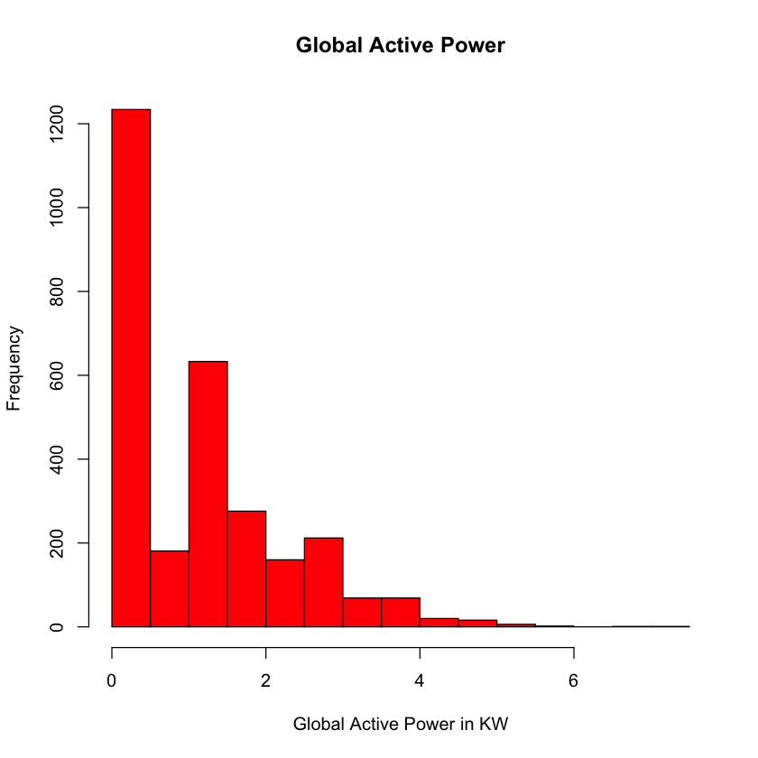
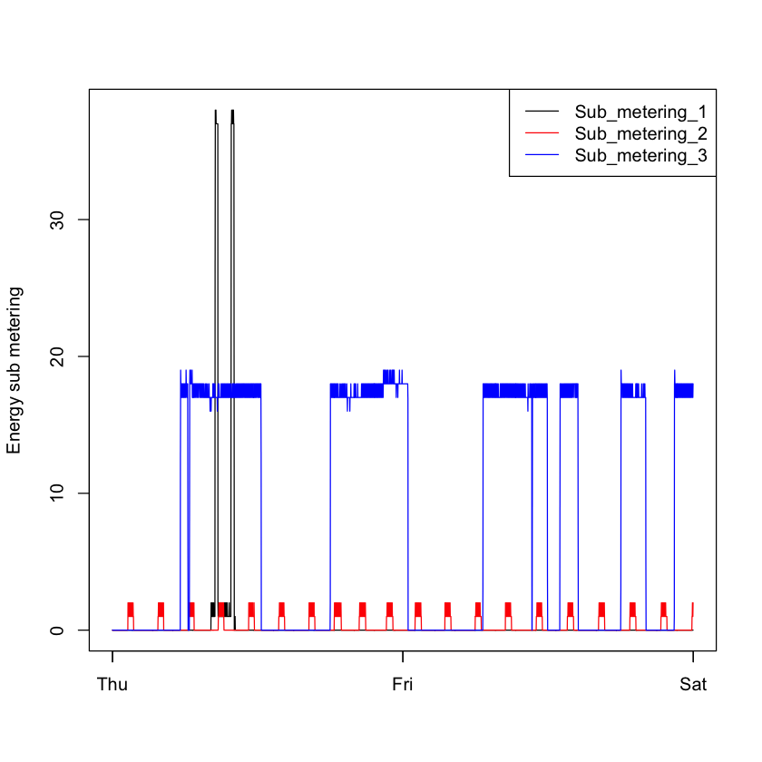
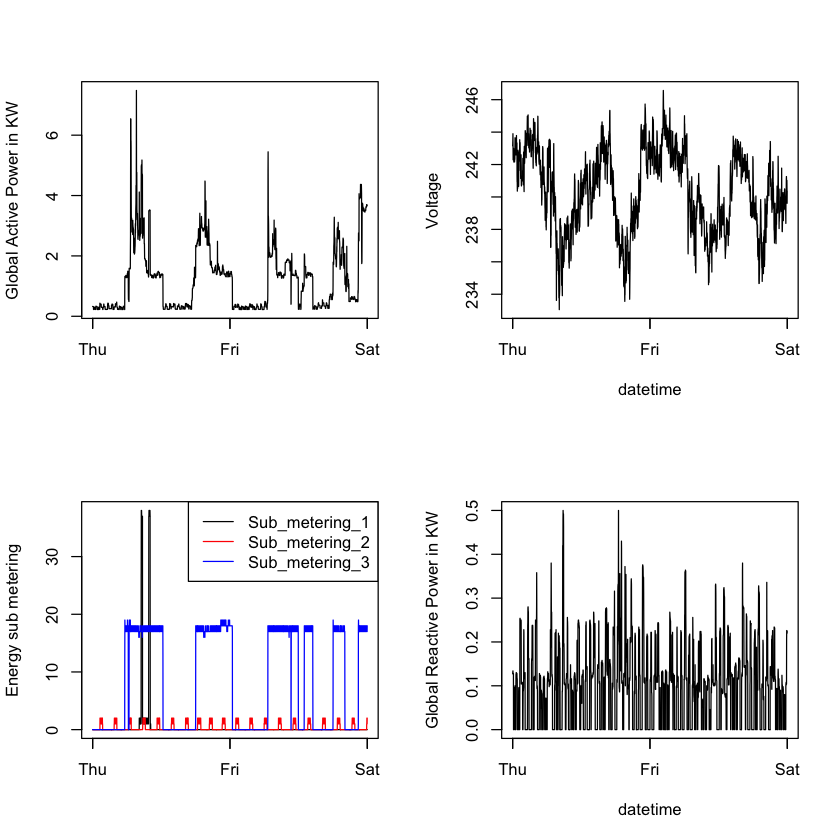

```R
Power <- read.table('household_power_consumption.txt', sep = ';', header = T, na.strings = c("NA","NaN", "?"))
head(Power)
```


<table>
<thead><tr><th scope=col>Date</th><th scope=col>Time</th><th scope=col>Global_active_power</th><th scope=col>Global_reactive_power</th><th scope=col>Voltage</th><th scope=col>Global_intensity</th><th scope=col>Sub_metering_1</th><th scope=col>Sub_metering_2</th><th scope=col>Sub_metering_3</th></tr></thead>
<tbody>
	<tr><td>16/12/2006</td><td>17:24:00  </td><td>4.216     </td><td>0.418     </td><td>234.84    </td><td>18.4      </td><td>0         </td><td>1         </td><td>17        </td></tr>
	<tr><td>16/12/2006</td><td>17:25:00  </td><td>5.360     </td><td>0.436     </td><td>233.63    </td><td>23.0      </td><td>0         </td><td>1         </td><td>16        </td></tr>
	<tr><td>16/12/2006</td><td>17:26:00  </td><td>5.374     </td><td>0.498     </td><td>233.29    </td><td>23.0      </td><td>0         </td><td>2         </td><td>17        </td></tr>
	<tr><td>16/12/2006</td><td>17:27:00  </td><td>5.388     </td><td>0.502     </td><td>233.74    </td><td>23.0      </td><td>0         </td><td>1         </td><td>17        </td></tr>
	<tr><td>16/12/2006</td><td>17:28:00  </td><td>3.666     </td><td>0.528     </td><td>235.68    </td><td>15.8      </td><td>0         </td><td>1         </td><td>17        </td></tr>
	<tr><td>16/12/2006</td><td>17:29:00  </td><td>3.520     </td><td>0.522     </td><td>235.02    </td><td>15.0      </td><td>0         </td><td>2         </td><td>17        </td></tr>
</tbody>
</table>


```R
library(lubridate)
date <- dmy(Power$Date)
Power$Date <- date
```


```R
head(date)
ind <- (date >= as.Date('2007-02-01') & date <= as.Date('2007-02-02'))
DataSet <- Power[ind, ]
```


<ol class=list-inline>
	<li><time datetime="2006-12-16">2006-12-16</time></li>
	<li><time datetime="2006-12-16">2006-12-16</time></li>
	<li><time datetime="2006-12-16">2006-12-16</time></li>
	<li><time datetime="2006-12-16">2006-12-16</time></li>
	<li><time datetime="2006-12-16">2006-12-16</time></li>
	<li><time datetime="2006-12-16">2006-12-16</time></li>
</ol>


```R
hist(DataSet$Global_active_power, col = 'red', main = 'Global Active Power', xlab = 'Global Active Power in KW')

dev.copy(png, file="plot1.png", height=480, width=480)
dev.off()
```


<strong>quartz_off_screen:</strong> 3


<strong>pdf:</strong> 2





```R
DateTime <- paste(DataSet$Date, DataSet$Time)
DataSet$DateTime <- ymd_hms(DateTime)
plot(DataSet$Global_active_power ~ DataSet$DateTime, type = 'l', ylab = 'Global Active Power in KW', xlab = '')

dev.copy(png, file="plot2.png", height=480, width=480)
dev.off()
```


<strong>quartz_off_screen:</strong> 3


<strong>pdf:</strong> 2


```R
plot(DataSet$Sub_metering_1 ~ DataSet$DateTime, type = 'l', col = 'black', ylab = 'Energy sub metering', xlab = '')
lines(DataSet$Sub_metering_2 ~ DataSet$DateTime, type = 'l', col = 'red')
lines(DataSet$Sub_metering_3 ~ DataSet$DateTime, type = 'l', col = 'blue')
legend("topright", col=c("black", "red", "blue"), lwd = c(1,1,1), c("Sub_metering_1", "Sub_metering_2", "Sub_metering_3"))

dev.copy(png, file="plot3.png", height=480, width=480)
dev.off()
```


<strong>quartz_off_screen:</strong> 3


<strong>pdf:</strong> 2





```R
par(mfrow = c(2,2))
plot(DataSet$Global_active_power ~ DataSet$DateTime, type = 'l', ylab = 'Global Active Power in KW', xlab = '')

plot(DataSet$Voltage ~ DataSet$DateTime, type = 'l', ylab = 'Voltage', xlab = 'datetime')

plot(DataSet$Sub_metering_1 ~ DataSet$DateTime, type = 'l', col = 'black', ylab = 'Energy sub metering', xlab = '')
lines(DataSet$Sub_metering_2 ~ DataSet$DateTime, type = 'l', col = 'red')
lines(DataSet$Sub_metering_3 ~ DataSet$DateTime, type = 'l', col = 'blue')
legend("topright", col=c("black", "red", "blue"), lwd = c(1,1,1), c("Sub_metering_1", "Sub_metering_2", "Sub_metering_3"))

plot(DataSet$Global_reactive_power ~ DataSet$DateTime, type = 'l', ylab = 'Global Reactive Power in KW', xlab = 'datetime')
dev.copy(png, file="plot4.png", height=480, width=480)
dev.off()
```


<strong>quartz_off_screen:</strong> 3


<strong>pdf:</strong> 2





```R

```
